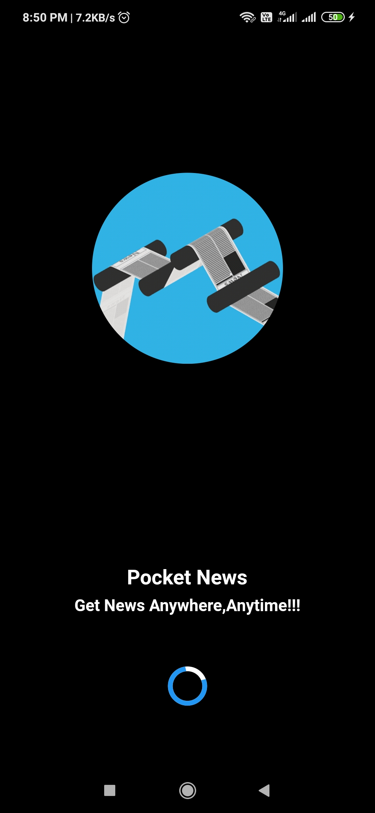
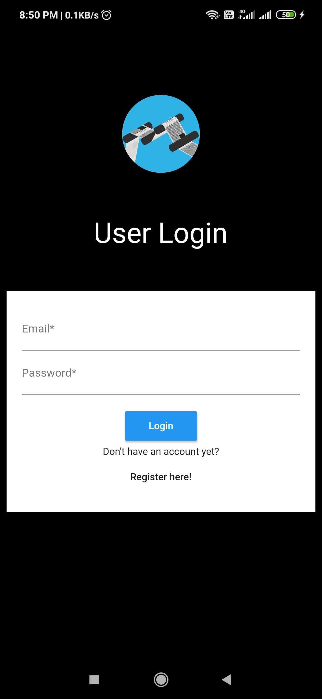
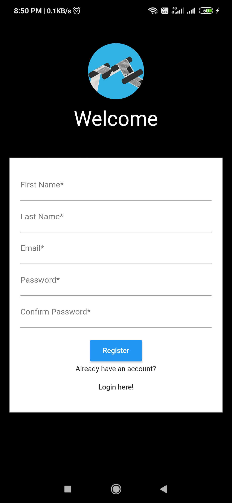
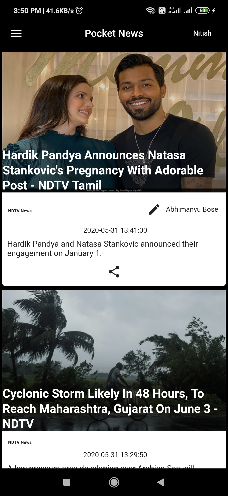
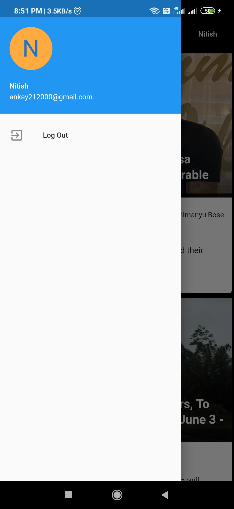

# Pocket News
A crossplatform app designed to get news after evry 1 hour

## Requirements
1. Flutter installed on your system
2. IDE (preferrably VS Code but sometimes exceptions are thrown that can be easily handled by Android Studios)
3. Emulator or Physical Device for debugging
## Images
# SplashPage

# LoginPage

# RegistrationPage

# HomePage

# Drawer

